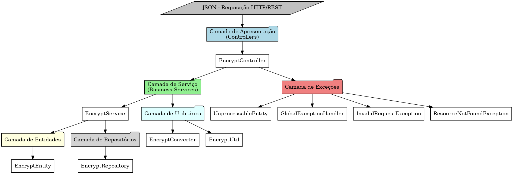
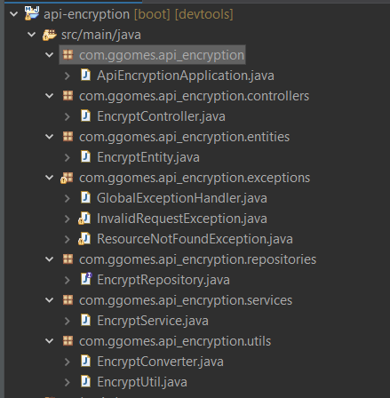
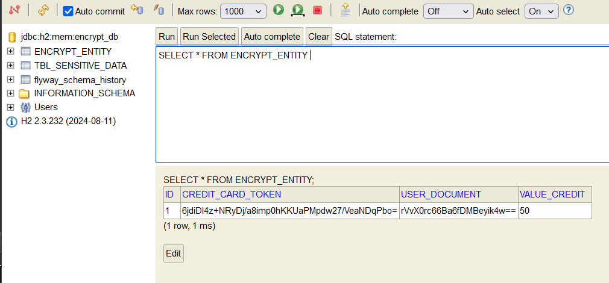
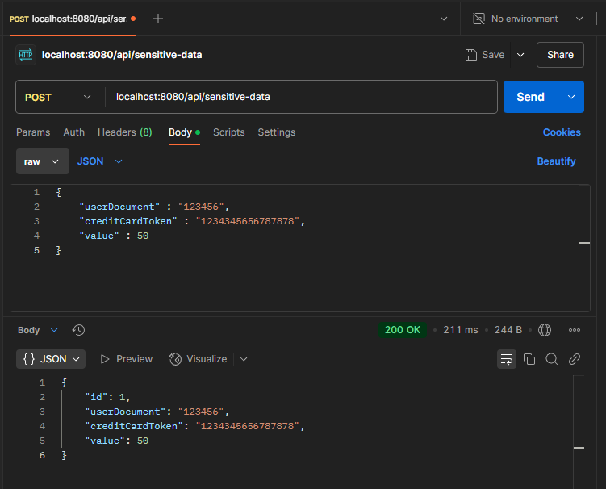
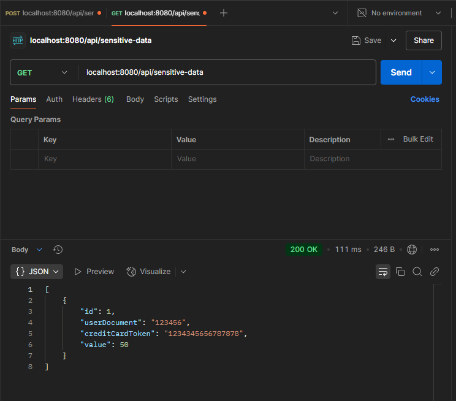

# Encrypt API

Resolution of the Backend-br Challenge.

You can access the GitHub repository for this project here:
[Encrypt-challenge](https://github.com/backend-br/desafios/blob/master/cryptography/PROBLEM.md)

---

This is a REST API for encrypting and decrypting sensitive data, ensuring security and confidentiality in data processing.

---

## Architecture Diagram

The project follows a layered architecture pattern, ensuring modularity, etc. The main layers include:

- **Presentation Layer**: Handles HTTP requests and responses, acting as the entry point for the API.
- **Service Layer**: Implements business logic and processes data before passing it between the controller and other layers.
- **Repository Layer**: Handles data persistence operations.
- **Exception Handling Layer**: Centralized handling of application exceptions to ensure consistent error responses.



---

## Technologies Used

- Java 23
- Spring Boot 3
- Maven
- Lombok

---

## Project Structure



---

## API Endpoints

### Encrypt Controller (`/api/sensitive-data`)

#### **Encrypt Data**
```http
POST /api/sensitive-data
```
**Request Body:**
```json
{
  "userDocument": "123456",
  "creditCardToken": "7890012334567890",
  "valueCredit": 5000
}
```
**Responses:**
- `200 OK` - Data encrypted successfully
- `400 Bad Request` - Invalid request data
- `500 Internal Server Error` - Internal API error

**Example Response:**
```json
{
  "id": 1,
  "userDocument": "4d2a3b6c7f...",
  "creditCardToken": "bXl0b2tlbjEyMw==",
  "valueCredit": 5000
}
```


**Database /h2-console**




#### **Retrieve Encrypted Data**
```http
GET /api/sensitive-data/{id}
```

**Responses:**
- `200 OK` - Data retrieved successfully
- `400 Bad Request` - Data not found
- `500 Internal Server Error` - Internal API error

**Example Response:**
```json
{
  "id": 1,
  "userDocument": "4d2a3b6c7f...",
  "creditCardToken": "bXl0b2tlbjEyMw==",
  "valueCredit": 5000
}
```

#### **Delete Encrypted Data**
```http
DELETE /api/sensitive-data/{id}
```

**Responses:**
- `200 OK` - Data deleted successfully
- `400 Bad Request` - Data not found
- `500 Internal Server Error` - Internal API error

---

## Running the Application

### Prerequisites
Ensure you have the following installed:
- Java 23
- Maven
- Lombok

### Build and Run
```sh
mvn clean install
mvn spring-boot:run
```

The application will start on `http://localhost:8080`.

---


**Request - Using Postman**



**Response - Using Postman**



---
